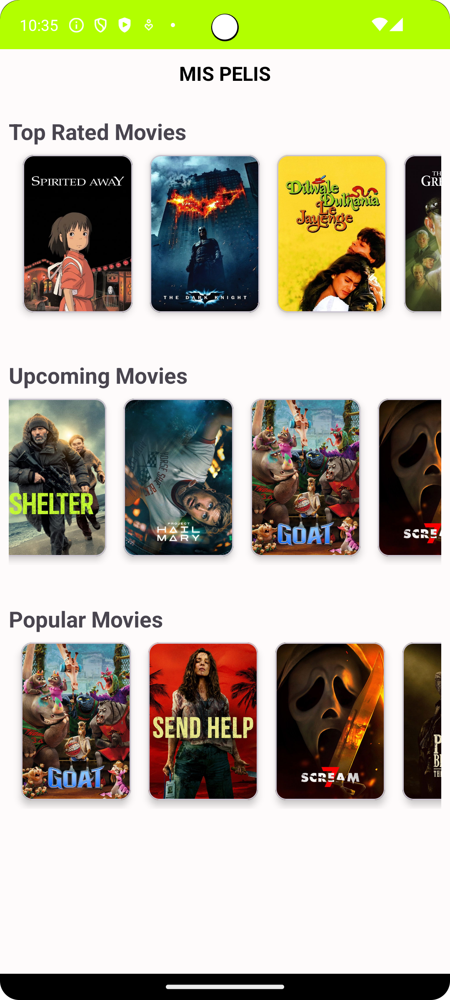
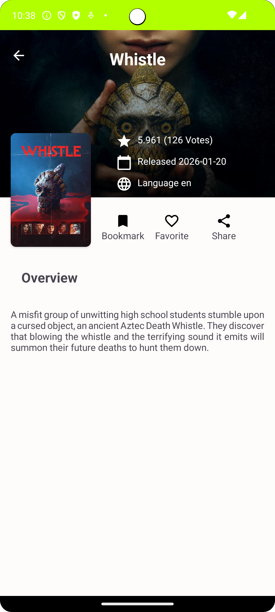

# 🎥Pelis Pro App
---
Pelis app built using MVVM architecture  + Retrofit + Coroutines + Navigation graph + StateFlow
## 📗Components used in app
___
- [Navigation Component](https://www.geeksforgeeks.org/android/jetpack-navigation-component-in-android/) - To manage navigation between activities/fragments.
- [ViewModel](https://developer.android.com/topic/libraries/architecture/viewmodel) - To manage the UI-related data
- [Coroutines](https://developer.android.com/kotlin/coroutines?hl=es-419) - For asynchronous operations.
- [Retrofit](https://square.github.io/retrofit/) - Network calls
- [Glide](https://github.com/bumptech/glide) - For loading images.
## 📝Description
___
NewsApp is simple app that brings the movies from [THE MOVIEDB API](https://www.themoviedb.org/)
## 🥅Screenshot
___

|                     Main                      |                     Detail                      |
| :-------------------------------------------: | :---------------------------------------------: |
|  |  |
|     **Picture 1:** Main Navigation Screen     |          **Picture 2:** Detail Screen           |

## 🛠️Tools:
---
- Kotlin 1.3.x
- Android Studio Meerkat  | 2024.3.2

## 📕Requirements:
---
- Compile Sdk 36
- MinsSdk 33
- TargetSdk 36
## 🎯 Project Roadmap
___
- [x]  **Modern Architecture (MVVM):** implementation of clean and scalable architecture using _ViewModel_.
- [x] **Reactive UI State:** Managing UI States with __StateFlow__ and Resource wrappers for Loading/Success/Failure.
- [x] **Concurrency and Streams:** Handling asychronous operations using kotlin Kotlin Coroutines and Flow.
- [x] **Remote Data Layer:**  Networking with __Retrofit & OkHttp__, including interceptors for API security and logging.
- [x] **Navigation & UI:** Safe navigation between screens using Navigation Component and Safe Args.
- [x] **Image Loading:** Optimized image fetching and caching with _Glide_.
- [ ] **Domain Layer:** Optimization - Refining bisiness logic using UseCase for better separation of concerns.
- [ ] **Advanced Pagination:** Implementing large dataset loading to improve performance.
- [ ] **Unit Testing:** Adding test for ViewModels and Repositories.

